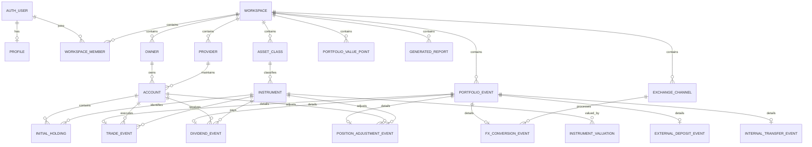

# Data Model

## 1. Purpose

This document defines the domain model and persistence rules for Portfolio Dashboard.

The model is designed to support:

- shared private access by a small number of authenticated users,
- multiple portfolio owners,
- multiple providers and accounts,
- configurable asset classes,
- instruments held across multiple accounts,
- initial holdings,
- detailed transaction history,
- manual instrument valuations,
- historical portfolio values,
- portfolio XIRR,
- weekly and monthly reports,
- JSON backup and restore.

The primary implementation target is PostgreSQL through Supabase.

## 2. Core modeling principles

### 2.1 Authenticated users and portfolio owners are separate concepts

An authenticated user is a person who can access the application.

A portfolio owner is a person to whom an investment account belongs.

These concepts must not be represented by the same database record.

This separation allows:

- two authenticated users to access the same household portfolio,
- both users to view and edit all shared portfolio data,
- accounts to remain formally assigned to a specific owner,
- an owner to exist without a separate application login,
- public demonstration data to use fictional owners.

### 2.2 Workspace-scoped data

All private portfolio data belongs to a workspace.

The production deployment may contain only one workspace, but workspace scoping is retained because it:

- provides a clear authorization boundary,
- simplifies Row Level Security,
- keeps the public application reusable,
- prevents domain records from being tied directly to a specific person.

Every private domain table must contain either:

- a direct `workspace_id`, or
- a foreign-key relationship leading unambiguously to a workspace.

### 2.3 Current holdings are calculated

Current holdings are not entered manually as a total portfolio snapshot.

Current quantities are calculated from:

```text
initial holdings
+ buy transactions
- sell transactions
+ position adjustments
```

Current values are calculated from:

```text
current quantity
× latest applicable unit valuation
× applicable PLN exchange rate
```

### 2.4 Historical reports do not replace source data

Generated reports and historical portfolio value points may be stored for reproducibility and long-term charts.

They do not replace:

- initial holdings,
- transactions,
- valuation updates,
- currency rates.

### 2.5 Behavior comes from record types

Version 1 does not use generic flags such as:

- `include_in_charts`,
- `include_in_xirr`,
- `include_in_dividend_stats`.

Behavior is determined from the semantic type of the record.

Examples:

- trades appear in weekly trade reports,
- dividends appear in dividend statistics,
- external deposits appear in contribution totals and XIRR,
- internal transfers do not count as new contributions,
- PPK accounts are excluded from XIRR,
- all active asset classes appear in asset-class structure reports.

### 2.6 Exact numeric types

Financial values must never be stored as floating-point numbers.

PostgreSQL `numeric` columns must be used for:

- quantities,
- unit prices,
- monetary amounts,
- exchange rates,
- portfolio values.

TypeScript calculations should use a decimal arithmetic library rather than JavaScript floating-point arithmetic.

## 3. High-level entity groups

The data model contains the following groups.

### Access and ownership

- `profiles`
- `workspaces`
- `workspace_members`
- `owners`

### Portfolio configuration

- `providers`
- `accounts`
- `exchange_channels`
- `asset_classes`
- `instruments`

### Detailed portfolio history

- `initial_holdings`
- `portfolio_events`
- `trade_events`
- `external_deposit_events`
- `internal_transfer_events`
- `dividend_events`
- `fx_conversion_events`
- `position_adjustment_events`
- `instrument_valuations`
- `fx_rates`

### Legacy and aggregated history

- `historical_external_deposits`
- `portfolio_value_points`

### Reports and application operations

- `generated_reports`

## 4. Shared conventions

Unless explicitly stated otherwise, domain tables should contain:

```text
id              UUID primary key
workspace_id    UUID foreign key
created_at      timestamptz
updated_at      timestamptz
created_by      UUID nullable reference to auth.users
```

Recommended defaults:

```text
id          gen_random_uuid()
created_at  now()
updated_at  now()
```

All user-editable records should update `updated_at` automatically.

Dates representing financial activity should use the `date` type.

Optional execution times should use the `time` type.

A missing execution time must remain `NULL`. It must not be replaced with midnight because midnight would incorrectly imply that an execution time was known.

System timestamps should use `timestamptz`.

## 5. Access and ownership model

## 5.1 profiles

Stores application-level information corresponding to Supabase authentication users.

The authentication identity remains in `auth.users`.

Fields:

```text
user_id         UUID primary key, references auth.users
display_name    text
created_at      timestamptz
updated_at      timestamptz
```

The profile does not represent portfolio ownership.

## 5.2 workspaces

Represents a private shared portfolio space.

Fields:

```text
id                          UUID primary key
name                        text not null
base_currency               char(3) not null default 'PLN'
timezone                    text not null default 'Europe/Warsaw'
detailed_tracking_start_date date nullable
created_at                  timestamptz
updated_at                  timestamptz
```

Rules:

- `base_currency` determines the main reporting currency.
- Version 1 assumes PLN as the production reporting currency.
- `detailed_tracking_start_date` marks the date from which transactions and holdings are tracked in detail.
- The baseline date must be production data and must not be hardcoded in the public repository.

## 5.3 workspace_members

Connects authenticated users to workspaces.

Fields:

```text
workspace_id    UUID references workspaces
user_id         UUID references auth.users
role            workspace_role not null
created_at      timestamptz
```

Primary key:

```text
(workspace_id, user_id)
```

Suggested roles:

```text
admin
editor
viewer
```

Version 1 behavior:

- `admin` may manage members and all portfolio data.
- `editor` may manage portfolio data but not workspace membership.
- `viewer` has read-only access.

Public registration is disabled.

Membership is created manually.

## 5.4 owners

Represents the formal owner of an investment account.

Fields:

```text
id              UUID primary key
workspace_id    UUID references workspaces
display_name    text not null
is_active       boolean not null default true
sort_order      integer not null default 0
created_at      timestamptz
updated_at      timestamptz
```

Rules:

- Real owner names exist only in the production database.
- Demonstration data uses fictional names.
- Owners are not linked directly to authentication users.
- An inactive owner remains available in historical records.

Recommended uniqueness:

```text
unique(workspace_id, display_name)
```

## 6. Portfolio configuration

## 6.1 providers

Represents the institution maintaining an investment account.

The name `provider` is intentionally broader than `broker`.

A provider may be:

- a brokerage,
- a bank,
- an investment fund manager,
- a cryptocurrency platform,
- another financial institution.

Fields:

```text
id              UUID primary key
workspace_id    UUID references workspaces
name            text not null
provider_type   provider_type not null
is_active       boolean not null default true
created_at      timestamptz
updated_at      timestamptz
```

Suggested provider types:

```text
brokerage
bank
fund_manager
crypto_platform
other
```

Recommended uniqueness:

```text
unique(workspace_id, name)
```

Providers referenced by historical accounts should be deactivated rather than deleted.

## 6.2 accounts

Represents a portfolio account.

Every account has three required identifying concepts:

```text
owner
provider
account name
```

Example display convention:

```text
Owner · Provider · Account name
```

Fields:

```text
id               UUID primary key
workspace_id     UUID references workspaces
owner_id         UUID references owners
provider_id      UUID references providers
name             text not null
account_type     account_type not null
base_currency    char(3) not null
is_active        boolean not null default true
created_at       timestamptz
updated_at       timestamptz
```

Suggested account types:

```text
brokerage_pln
brokerage_foreign
ike
ikze
oki
ppk
bonds
crypto
other
```

Example account names:

```text
PLN
USD
IKE
IKZE
OKI
PPK
Bonds
BTC
```

Rules:

- `provider_id` is mandatory.
- `owner_id` is mandatory.
- The same provider may maintain many accounts.
- The same owner may have many accounts.
- PPK behavior is determined from `account_type = 'ppk'`.
- PPK accounts are included in total displayed portfolio value.
- PPK accounts are excluded from XIRR terminal value.
- Accounts referenced by history should be deactivated rather than deleted.

Recommended uniqueness:

```text
unique(workspace_id, owner_id, provider_id, name)
```

## 6.3 exchange_channels

Represents a channel used to exchange currencies.

An exchange channel is not a portfolio account.

Fields:

```text
id              UUID primary key
workspace_id    UUID references workspaces
name            text not null
is_active       boolean not null default true
created_at      timestamptz
updated_at      timestamptz
```

Examples may include:

```text
Revolut
Walutomat
Provider FX
Other
```

Recommended uniqueness:

```text
unique(workspace_id, name)
```

## 6.4 asset_classes

Represents a configurable portfolio asset class.

Fields:

```text
id              UUID primary key
workspace_id    UUID references workspaces
name            text not null
color_hex       char(7) not null
sort_order      integer not null default 0
is_active       boolean not null default true
created_at      timestamptz
updated_at      timestamptz
```

Default asset classes:

```text
Polish Stocks
Global ETFs
Treasury Bonds
Semiconductors
Bitcoin & Crypto
US REITs
PPK Employment Plan
```

Default chart colors:

```text
Polish Stocks          #3450A4
Global ETFs            #7E3FF2
Treasury Bonds         #8D99AE
Semiconductors         #24A6A8
Bitcoin & Crypto       #F2B000
US REITs               #E76F51
PPK Employment Plan    #C06C84
```

Rules:

- Names are user-editable.
- Colors are user-editable.
- Display order is user-editable.
- Additional asset classes may be created.
- Reports must not assume exactly seven asset classes.
- All active asset classes are eligible for asset-class structure reports.
- Historical classes should be deactivated rather than deleted.

Validation:

```text
color_hex must match ^#[0-9A-Fa-f]{6}$
```

Recommended uniqueness:

```text
unique(workspace_id, name)
```

## 6.5 instruments

Represents a specific tradable instrument or investment product.

An instrument should represent a specific listing when different listings have different:

- tickers,
- exchanges,
- currencies.

Fields:

```text
id                UUID primary key
workspace_id      UUID references workspaces
name              text not null
ticker            text nullable
exchange          text nullable
asset_class_id    UUID references asset_classes
default_currency  char(3) not null
is_active         boolean not null default true
created_at        timestamptz
updated_at        timestamptz
```

Rules:

- Every instrument belongs to exactly one asset class.
- An instrument may be held on multiple accounts.
- The instrument dictionary remembers the asset class for future transactions.
- Deactivating an instrument does not remove it from historical records.
- Instruments referenced by history should not be hard-deleted.

Examples of distinct instrument representation:

```text
A company listed in USD and the same company listed in EUR
may be represented by separate instrument records.
```

Indexes should support searching by:

```text
workspace_id
name
ticker
asset_class_id
is_active
```

A strict unique ticker constraint is not required because ticker symbols may repeat across exchanges.

## 7. Initial holdings

## 7.1 initial_holdings

Stores instrument quantities at the beginning of detailed tracking.

Fields:

```text
id              UUID primary key
workspace_id    UUID references workspaces
as_of_date      date not null
account_id      UUID references accounts
instrument_id   UUID references instruments
quantity        numeric(28, 12) not null
note            text nullable
created_at      timestamptz
updated_at      timestamptz
created_by      UUID nullable references auth.users
```

Rules:

- Quantity may include fractional units.
- Quantity must normally be greater than or equal to zero.
- Initial holdings do not require a purchase cost.
- Initial holdings define quantity, not current value.
- Current value comes from valuation updates.
- The same instrument may have separate initial holdings on multiple accounts.
- Events before the baseline date must not be applied to detailed current-holdings calculations.

Recommended uniqueness:

```text
unique(workspace_id, as_of_date, account_id, instrument_id)
```

## 8. Portfolio event architecture

Financial activity is represented using:

- a common event header,
- one type-specific detail record.

This avoids a single table containing many unrelated nullable columns.

It also allows type-specific database constraints.

## 8.1 portfolio_events

Stores fields common to all portfolio activities.

Fields:

```text
id              UUID primary key
workspace_id    UUID references workspaces
event_type      portfolio_event_type not null
event_date      date not null
event_time      time nullable
note            text nullable
created_at      timestamptz
updated_at      timestamptz
created_by      UUID nullable references auth.users
updated_by      UUID nullable references auth.users
```

Event types:

```text
trade
external_deposit
internal_transfer
dividend
fx_conversion
position_adjustment
```

Rules:

- `event_date` is mandatory.
- `event_time` is optional.
- One event must have exactly one matching type-specific detail row.
- Event creation and detail creation must occur atomically in one database transaction.
- Event deletion must delete its detail row through cascading foreign keys.
- The application must prevent an event type from being paired with the wrong detail table.

## 8.2 trade_events

Represents a buy or sell transaction.

Fields:

```text
event_id                       UUID primary key references portfolio_events
side                           trade_side not null
account_id                     UUID references accounts
instrument_id                  UUID references instruments
quantity                       numeric(28, 12) not null
cash_amount                    numeric(24, 8) not null
currency                       char(3) not null
fee_amount                     numeric(24, 8) nullable
execution_unit_price           numeric(24, 10) nullable
fx_rate_to_pln                 numeric(24, 12) nullable
amount_pln                     numeric(24, 8) not null
linked_fx_conversion_event_id  UUID nullable references portfolio_events
```

Trade sides:

```text
buy
sell
```

Rules:

- `quantity` is stored as an absolute positive value.
- `cash_amount` is stored as an absolute positive value.
- The trade side determines whether quantity increases or decreases.
- `amount_pln` stores the confirmed historical PLN transaction value.
- Historical reports must use stored `amount_pln`, not a later market exchange rate.
- If currency is PLN, `fx_rate_to_pln` should normally equal `1`.
- `execution_unit_price` may be entered or derived from amount and quantity.
- `fee_amount` is optional in version 1.
- A linked FX conversion is optional.
- A trade appears in weekly trade reports.

Quantity effect:

```text
buy   => +quantity
sell  => -quantity
```

Before saving a sell, the application should calculate the resulting holding and warn if it would become negative.

Negative holdings should require an explicit reconciliation workflow.

## 8.3 external_deposit_events

Represents new external capital entering the investment portfolio.

Fields:

```text
event_id        UUID primary key references portfolio_events
account_id      UUID references accounts
amount          numeric(24, 8) not null
currency        char(3) not null
fx_rate_to_pln  numeric(24, 12) nullable
amount_pln      numeric(24, 8) not null
```

Rules:

- An external deposit counts as a portfolio contribution.
- It is included in weekly contribution totals.
- It is included as a negative cash flow in XIRR.
- It does not directly change instrument quantities.
- Transfers from outside the tracked portfolio into a tracked account are external deposits.
- A deposit must be recorded only once, at its first entry into the tracked portfolio.

## 8.4 internal_transfer_events

Represents movement of existing portfolio money between tracked accounts.

Fields:

```text
event_id         UUID primary key references portfolio_events
from_account_id  UUID references accounts
to_account_id    UUID references accounts
amount           numeric(24, 8) not null
currency         char(3) not null
```

Rules:

- Source and destination accounts must be different.
- An internal transfer is stored historically.
- It is not a new contribution.
- It is excluded from XIRR cash flows.
- It is excluded from weekly external-deposit totals.
- It does not directly change instrument quantities.
- Transfers from a PLN account to IKE, IKZE or OKI remain internal transfers.

## 8.5 dividend_events

Represents a received dividend.

Fields:

```text
event_id               UUID primary key references portfolio_events
account_id             UUID references accounts
instrument_id          UUID references instruments
amount_received        numeric(24, 8) not null
currency               char(3) not null
withholding_tax_amount numeric(24, 8) nullable
fx_rate_to_pln         numeric(24, 12) nullable
amount_pln             numeric(24, 8) nullable
```

Rules:

- Dividends are stored historically.
- Dividends are excluded from standard weekly buy and sell charts.
- Dividends do not change instrument quantities.
- Dividend statistics are derived from this event type.
- No separate `include_in_dividend_stats` flag is used.
- If `amount_pln` is present, PLN dividend summaries should use it.
- If `amount_pln` is absent, a report must clearly identify the rate used for conversion.

Possible summaries:

```text
by month
by year
by instrument
by account
by owner
by provider
```

## 8.6 fx_conversion_events

Represents a currency exchange.

Fields:

```text
event_id             UUID primary key references portfolio_events
exchange_channel_id  UUID references exchange_channels
from_amount          numeric(24, 8) not null
from_currency        char(3) not null
to_amount            numeric(24, 8) not null
to_currency          char(3) not null
from_account_id      UUID nullable references accounts
to_account_id        UUID nullable references accounts
```

Rules:

- Source and target currencies must differ.
- Both amounts must be positive.
- The implied exchange rate is derived from the recorded amounts.
- An FX conversion is stored historically.
- It is excluded from weekly buy and sell charts.
- It is excluded from contribution totals.
- The exchange channel is not treated as an investment account.
- Account references are optional because exchange channels are not tracked as cash-holding accounts.

Derived rates:

```text
to_amount / from_amount
from_amount / to_amount
```

The application should display the rate in the direction most useful to the user.

## 8.7 position_adjustment_events

Represents an explicit correction to an instrument quantity.

Fields:

```text
event_id        UUID primary key references portfolio_events
account_id      UUID references accounts
instrument_id   UUID references instruments
quantity_delta  numeric(28, 12) not null
reason          text not null
```

Rules:

- `quantity_delta` may be positive or negative.
- Zero is not allowed.
- A reason is mandatory.
- Adjustments are clearly separated from trades.
- Adjustments affect current quantities.
- Adjustments do not appear as buys or sells in standard weekly charts.
- Adjustments are intended for reconciliation, corrections, splits or imported-history fixes.

## 9. Instrument valuation history

## 9.1 instrument_valuations

Stores manually entered historical unit values.

Fields:

```text
id               UUID primary key
workspace_id     UUID references workspaces
instrument_id    UUID references instruments
valuation_date   date not null
valuation_time   time nullable
unit_price       numeric(24, 10) not null
currency         char(3) not null
source           valuation_source not null default 'manual'
note             text nullable
created_at       timestamptz
updated_at       timestamptz
created_by       UUID nullable references auth.users
```

Suggested valuation sources:

```text
manual
imported
automatic
```

Rules:

- `unit_price` must be greater than or equal to zero.
- Full valuation history is retained.
- The latest valuation is selected by effective date and optional time.
- If two updates share the same date and neither has a time, the later `created_at` record wins.
- A valuation currency should normally match the instrument default currency.
- A different currency may be allowed only with explicit user confirmation.

Latest valuation ordering:

```text
valuation_date desc
valuation_time desc nulls last
created_at desc
```

## 10. Currency rates

## 10.1 fx_rates

Stores PLN conversion rates used for valuations and reports.

Fields:

```text
id                         UUID primary key
workspace_id               UUID references workspaces
rate_date                   date not null
from_currency               char(3) not null
to_currency                 char(3) not null default 'PLN'
rate                        numeric(24, 12) not null
source                      fx_rate_source not null
linked_fx_conversion_event_id UUID nullable references portfolio_events
note                        text nullable
created_at                  timestamptz
created_by                  UUID nullable references auth.users
```

Suggested sources:

```text
manual
nbp
implied
imported
```

Rules:

- `rate` must be positive.
- Source and target currencies must differ.
- Version 1 primarily converts EUR and USD to PLN.
- Manual rates remain supported even if automatic NBP retrieval is introduced.
- An implied rate may reference an FX conversion.
- Historical generated reports must preserve the exact rates they used.

For PLN:

```text
PLN to PLN rate = 1
```

A separate database row is not required for PLN-to-PLN conversion.

## 11. Aggregated historical period

Detailed transaction history may not exist for the entire portfolio lifetime.

Historical tables support periods before the detailed tracking baseline.

## 11.1 historical_external_deposits

Stores individual historical portfolio contributions preceding detailed event tracking.

Fields:

```text
id              UUID primary key
workspace_id    UUID references workspaces
deposit_date    date not null
amount_pln      numeric(24, 8) not null
source          historical_source not null default 'manual'
note            text nullable
created_at      timestamptz
updated_at      timestamptz
created_by      UUID nullable references auth.users
```

Suggested historical sources:

```text
manual
chat_reconstruction
imported
verified
```

Rules:

- Each record represents an individual dated contribution.
- Values are not cumulative balances.
- Amounts must be positive.
- These records are included in XIRR cash flows.
- They are combined with detailed external-deposit events after the baseline date.
- A contribution must not exist in both historical deposits and detailed events.

Why individual deposits are required:

```text
XIRR depends on the date and amount of every external cash flow.
A cumulative contribution balance alone is insufficient.
```

Cumulative contributions for charts are calculated as a running sum.

## 11.2 portfolio_value_points

Stores historical total portfolio values, primarily for periods before detailed tracking.

Fields:

```text
id                   UUID primary key
workspace_id         UUID references workspaces
valuation_date       date not null
total_value_pln      numeric(24, 8) not null
ppk_value_pln        numeric(24, 8) not null default 0
source               historical_source not null
note                 text nullable
created_at           timestamptz
updated_at           timestamptz
created_by           UUID nullable references auth.users
```

Rules:

- `total_value_pln` includes PPK.
- `ppk_value_pln` identifies the part excluded from XIRR terminal value.
- `ppk_value_pln` must not exceed `total_value_pln`.
- These points support the Assets over time report.
- Imported historical values are reviewable and editable.
- A stored value point is not the source of truth for current detailed holdings.
- After detailed tracking begins, monthly points may be generated from calculated holdings and locked for historical reproducibility.

Recommended uniqueness:

```text
unique(workspace_id, valuation_date)
```

Derived non-PPK value:

```text
total_value_pln - ppk_value_pln
```

## 12. Generated reports

## 12.1 generated_reports

Stores generated report metadata and reproducible source data.

Fields:

```text
id                  UUID primary key
workspace_id        UUID references workspaces
report_type         report_type not null
period_start        date nullable
period_end          date nullable
valuation_date      date nullable
title               text not null
parameters_json     jsonb not null
source_data_json    jsonb not null
image_storage_path  text nullable
created_at          timestamptz
created_by          UUID nullable references auth.users
```

Suggested report types:

```text
weekly_trades
weekly_asset_classes
polish_stocks_structure
international_structure
assets_by_account
assets_over_time
asset_class_structure
xirr_summary
dividend_summary
```

Rules:

- The image should be stored in a private storage bucket.
- `source_data_json` preserves the values shown by the report.
- `parameters_json` preserves:
  - date ranges,
  - selected FX rates,
  - chart settings,
  - filters,
  - labels,
  - asset-class colors used at generation time.
- Renaming an asset class later must not silently rewrite an old report.
- A report may be regenerated from current source data, but the historical generated record remains unchanged.
- PNG export is optional until the image has been successfully created.

## 13. Derived calculations

Derived values should not be stored unless they are required for historical reproducibility.

## 13.1 Current quantity per account and instrument

For a selected date:

```text
initial quantity
+ sum(buy quantities)
- sum(sell quantities)
+ sum(position adjustment deltas)
```

Only events after the applicable initial-holding date and on or before the selected date are included.

Grouping key:

```text
workspace_id
account_id
instrument_id
```

## 13.2 Current quantity per instrument

Aggregate account-level quantities by:

```text
workspace_id
instrument_id
```

This is used for reports that combine the same instrument across accounts.

## 13.3 Latest unit valuation

For each instrument, select the latest valuation effective on or before the requested report date.

A report must never use a valuation entered after its valuation date unless the user explicitly requests that behavior.

## 13.4 Current holding value

Original currency:

```text
quantity × unit_price
```

PLN:

```text
quantity × unit_price × applicable_fx_rate
```

For PLN instruments:

```text
applicable_fx_rate = 1
```

## 13.5 Total portfolio value

```text
sum(all active holding values in PLN)
```

PPK is included.

## 13.6 XIRR terminal value

```text
total portfolio value
- value of accounts where account_type = 'ppk'
```

No generic `include_in_xirr` flag is used.

## 13.7 Weekly external deposits

```text
sum(external_deposit_events.amount_pln)
```

for the inclusive selected date range.

Internal transfers are excluded.

## 13.8 Weekly trade values

Trades are aggregated by instrument across all accounts.

Buy values are positive.

Sell values are negative.

Grouping key:

```text
instrument_id
```

## 13.9 Dividend totals

Dividend statistics are derived exclusively from `dividend_events`.

No separate inclusion flag is used.

## 14. XIRR cash-flow construction

The XIRR cash-flow vector combines:

1. historical external deposits before detailed tracking,
2. detailed external-deposit events after detailed tracking begins,
3. one terminal non-PPK portfolio value.

Deposit sign:

```text
negative
```

Terminal value sign:

```text
positive
```

Excluded:

```text
internal transfers
dividends
FX conversions
trade cash movements
PPK contributions
PPK terminal value
```

Trade purchases and sales are internal portfolio activity and do not become external XIRR cash flows.

Example conceptual vector:

```text
2024-04-02  -12000 PLN
2024-05-12   -4000 PLN
...
2026-08-04  +terminal non-PPK portfolio value
```

The application must expose the constructed cash-flow vector for user verification.

XIRR should be calculated using date differences based on a 365-day year.

The numerical solver must:

- use deterministic tolerances,
- detect non-convergence,
- reject vectors without at least one positive and one negative cash flow,
- present a clear error instead of returning an invalid result.

## 15. Editing and deletion rules

### Configuration records

The following should normally be deactivated rather than deleted once referenced:

- owners,
- providers,
- accounts,
- asset classes,
- instruments,
- exchange channels.

### Financial records

Users may edit or delete:

- initial holdings,
- portfolio events,
- valuation updates,
- historical deposits,
- historical portfolio value points.

Every destructive action should require confirmation.

A future audit-log feature may be added, but it is not required for version 1.

Generated reports should not be silently changed when their source data is edited.

The user may:

- keep the historical report,
- regenerate a new report,
- explicitly delete the old report.

## 16. Database constraints

Recommended constraints include:

```text
quantity > 0 for ordinary trades
cash_amount > 0
amount > 0 for deposits and transfers
unit_price >= 0
fx rate > 0
from_currency <> to_currency
from_account_id <> to_account_id
quantity_delta <> 0
ppk_value_pln >= 0
ppk_value_pln <= total_value_pln
```

Workspace consistency must be validated.

Examples:

- an account and instrument used by an event must belong to the same workspace as the event,
- an account owner and provider must belong to the same workspace as the account,
- an instrument and its asset class must belong to the same workspace.

These constraints may require PostgreSQL triggers or transactional application services because ordinary foreign keys do not validate all cross-table workspace relationships.

## 17. Row Level Security

Row Level Security must be enabled on every private application table.

Access is granted only when the authenticated user is a member of the relevant workspace.

Conceptual policy:

```sql
exists (
  select 1
  from workspace_members
  where workspace_members.workspace_id = table.workspace_id
    and workspace_members.user_id = auth.uid()
)
```

Write permissions additionally depend on role:

```text
admin   -> read and write
editor  -> read and write portfolio data
viewer  -> read only
```

No portfolio table should allow anonymous access.

The Supabase service-role key must never be exposed to browser code.

## 18. JSON export model

A complete export should contain:

```text
schemaVersion
exportedAt
workspace
owners
providers
accounts
exchangeChannels
assetClasses
instruments
initialHoldings
portfolioEvents
eventDetails
instrumentValuations
fxRates
historicalExternalDeposits
portfolioValuePoints
generatedReportMetadata
```

Generated PNG image files may be exported separately or represented by metadata paths.

The JSON export should:

- preserve stable UUID relationships,
- preserve decimal values as strings,
- include a schema version,
- be validated before import,
- avoid dependence on database-specific row ordering.

Real exports must never be committed to the public repository.

## 19. Numeric precision recommendations

Recommended PostgreSQL types:

```text
Instrument quantities      numeric(28, 12)
Unit prices                numeric(24, 10)
Currency amounts           numeric(24, 8)
PLN report values          numeric(24, 8)
Exchange rates             numeric(24, 12)
```

Display precision is separate from storage precision.

Typical display:

```text
PLN, EUR, USD amounts      2 decimal places
Instrument quantities      up to 12 decimal places, trimmed
Percentages                1 or 2 decimal places
XIRR                       2 decimal places
```

Calculations must use unrounded stored values.

Rounding occurs only for presentation.

## 20. Recommended indexes

Indexes should support common filters and calculations.

Recommended indexes:

```text
workspace_members(user_id, workspace_id)

accounts(workspace_id, owner_id)
accounts(workspace_id, provider_id)

instruments(workspace_id, asset_class_id)
instruments(workspace_id, ticker)
instruments(workspace_id, is_active)

initial_holdings(workspace_id, account_id, instrument_id)

portfolio_events(workspace_id, event_date)
portfolio_events(workspace_id, event_type, event_date)

trade_events(account_id, instrument_id)
trade_events(instrument_id)

external_deposit_events(account_id)
dividend_events(instrument_id)
dividend_events(account_id)

instrument_valuations(workspace_id, instrument_id, valuation_date)

fx_rates(workspace_id, from_currency, to_currency, rate_date)

historical_external_deposits(workspace_id, deposit_date)
portfolio_value_points(workspace_id, valuation_date)

generated_reports(workspace_id, report_type, created_at)
```

## 21. Conceptual relationship diagram



## 22. Version 1 implementation decisions

Version 1 will use:

- shared workspace access,
- separate authenticated users and portfolio owners,
- PostgreSQL UUID primary keys,
- exact decimal storage,
- normalized event detail tables,
- required providers for all accounts,
- configurable asset classes and colors,
- manually entered valuations,
- manually entered or optionally retrieved FX rates,
- event-derived chart inclusion rules,
- account-type-based PPK exclusion from XIRR,
- historical individual contribution cash flows,
- JSON backup and restore.

Version 1 will not use:

- generic chart-inclusion flags,
- generic XIRR-inclusion flags,
- dividend-statistics flags,
- cash balances as portfolio holdings,
- exchange channels as portfolio accounts,
- manually entered current-holdings totals as the source of truth,
- broker integrations,
- public portfolio access.